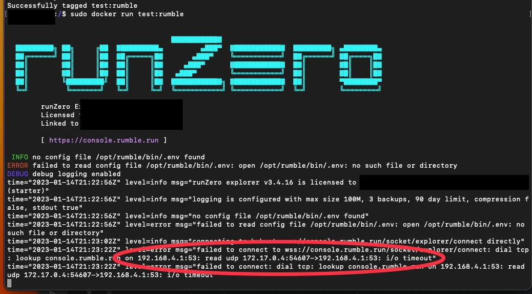
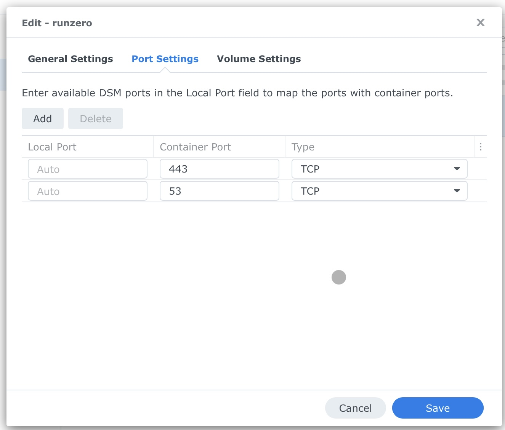
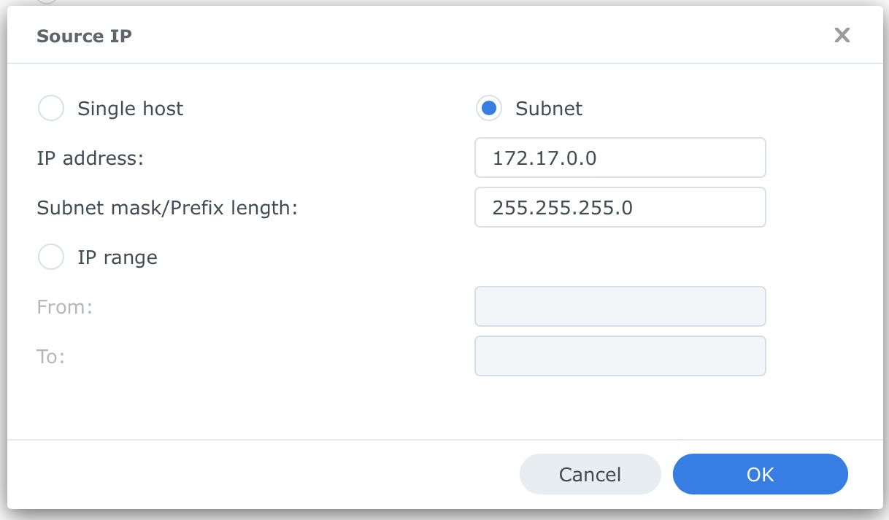

## RunZero Network Explorer on Synology NAS

This will show you how to deploy RunZero Network Explorer in a non-persistent container, on a Synology NAS using Docker. Comments and Wireless scanning have been stripped from the Dockerfile because they break it for some reason in DSM. This Dockerfile also uses `ubuntu:latest` instead of `debian:stable-slim` like is listed in the official docs. You can learn more about RunZero here https://www.runzero.com 

Shout out to Pearce Barry @ RunZero Engineering for helping with this.
 
PREREQUISITES
- Synology NAS using DSM 7
- Docker
- Knowledge on how to set firewall settings and ports on your Synology.

TESTED ON
- DS220+

### Dockerfile contents

>FROM ubuntu:latest
>
>WORKDIR /opt/rumble
>
>ENV AGENT_URL=https://console.runzero.com/download/explorer/DT[uniqueToken]/[versionID]]/runzero-explorer-linux-amd64.bin
>
>ENV RUMBLE_AGENT_HOST_ID=hex string identifier
>
>ENV RUMBLE_AGENT_LOG_DEBUG=false
>
>ADD ${AGENT_URL} runzero-explorer.bin
>
>RUN chmod +x runzero-explorer.bin
>
>USER root
>
>ENTRYPOINT [ "/opt/rumble/runzero-explorer.bin", "manual"]``
 
The argument `manual` tells runZero not to look for SystemD or upstart. For non-persistent containers an Explorer identifier needs to be persisted through an environment variable. You can set the `RUMBLE_AGENT_HOST_ID` to a unique string to identify the explorer in your org.

To generate a suitable identifier, the openssl tool may be used:

`openssl rand -hex 16`

Once the correct ENV values are in the Dockerfile, save it. Create a `runzero` folder in the docker folder on your NAS and upload the Dockerfile to it.

SSH in to your NAS 

`ssh user@ip`

Navigate to the runzero folder that you created earlier.

`cd /volume1/docker/runzero`

Perform the following (you can change the name or tag to whatever you like)

`sudo docker build -t “synology:runzero” .`

`sudo docker run —-name=“runzero” synology:runzero`

Initially the container will have broken networking, look in the logs to find the IP/Subnet that docker is using for the container

Once you have this info, stop the container, select it and edit the container details. RunZero needs port 443 to run, and it appears 53. Input the values in to port section of the container settings for the container, and leave it to Auto for local. You may need to adjust your Synology Firewall

Optionally, you can add the entire subnet docker is using as well

Start the container again, and it should connect and register to the rumble console.

EXTRA INFO

When viewing the logs of the container, you can ignore the “ERROR failed to read config file /opt/rumble/bin/.env: open /opt/rumble/bin/.env: no such file or directory” error for this install, the Explorer will just fallback to using the environment vars defined in the Dockerfile.
